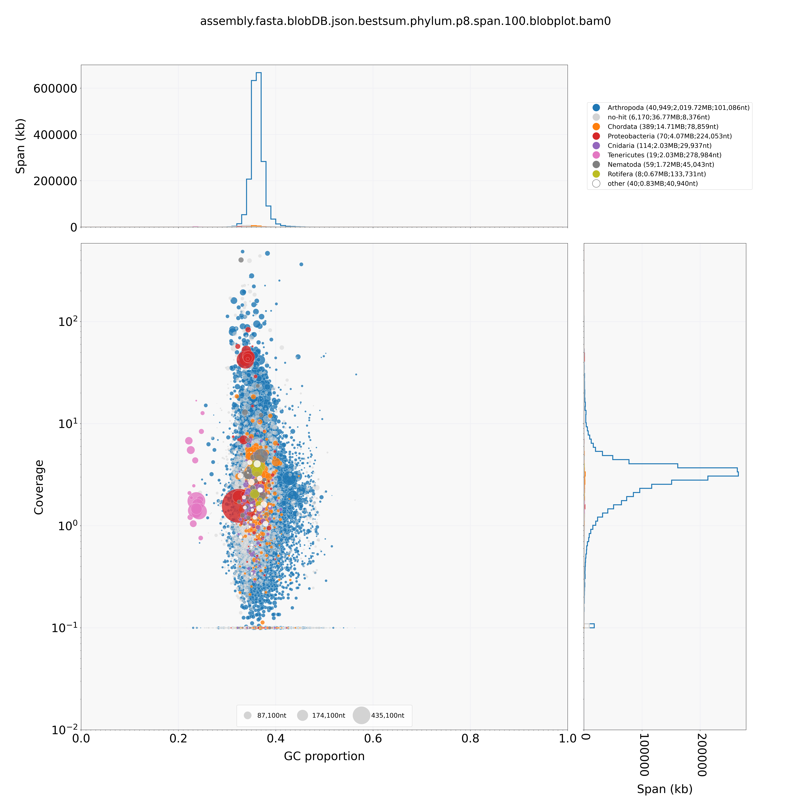
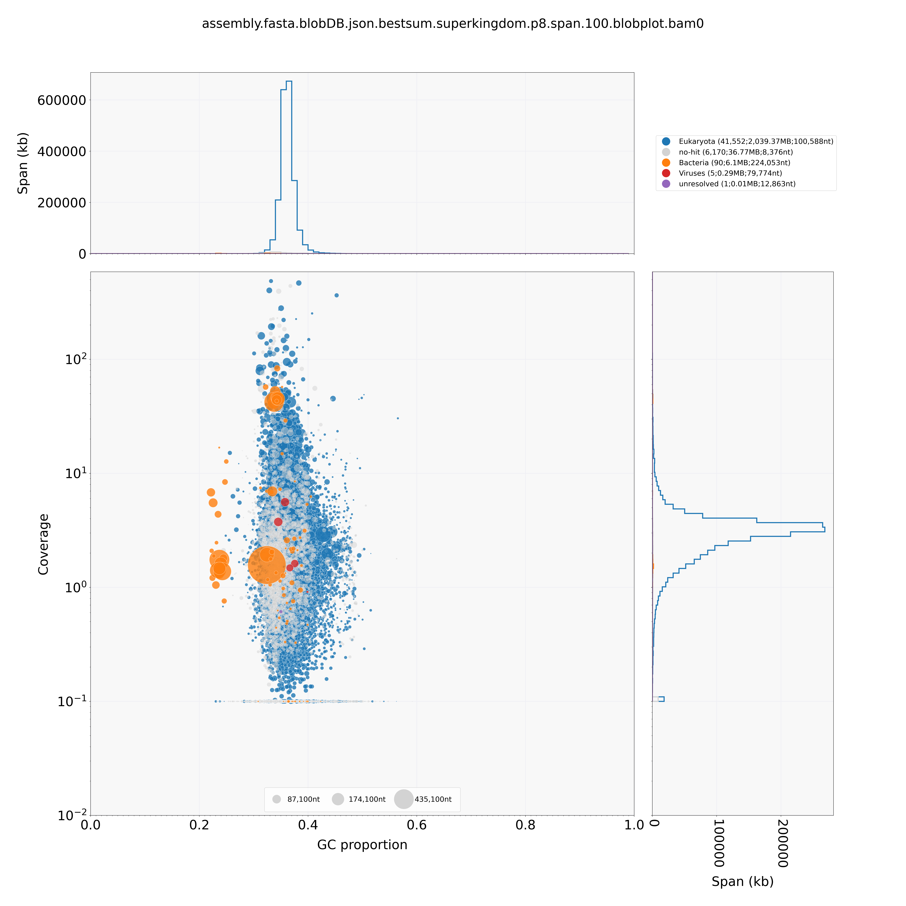

# Blobtools QC of assemblies

Blobtools provides some nice plots to help QC and troubleshoota assemblies. Decided to put this part in a separate dir, rather than in with the assemblies because blobtools need quite a lot of stuff, including local blast/diamond databases.

## Diamond databases

Set these up with their own makefile, to help keep things organized. Databases need to include taxonomic information. Used the instructions found at https://www.uppmax.uu.se/resources/databases/diamond-protein-alignment-databases/ and https://blobtools.readme.io/docs/taxid-mapping-file as a basis for this.

### Database choice

The main thing we want from blobtools is to detect contigs that are obvious contaminants, mostly gut microorganisms. This means we don't need super precise taxonomy assignments. It would also be good to use a resonably small database to keep the search time reasonable. As a first try, go with UniRef 90.

### Taxid files

Blobtools can add taxonomic infor to the results of a diamond or blast search. It needs a tsv file with mappings between sequence IDs ans NCBI taxonomy numbers. Fortunately, the UniRef 90 sequence headers include a field `TaxID=`, which gives the NCBI taxonomy.

## NodesDB File

From https://blobtools.readme.io/docs/taxonomy-database

*"A nodesDB file is a "condensed" version of NCBI's nodes.dmp and names.dmp files and faster to parse."*

*"

Format

 - A header indicating the number of nodes, followed by TAB-separated lines containing
 - TaxID of node
 - Taxonomic rank of node
 - Name of node
 - TaxID of parent node
 
"*

Used sqlite3 to merge the required columns from nodes.dmp and names.dmp

It turns out that thus is not actually needed - blobtools can use the nodes.dmp and names.dmp files directly, and the file I made could not be parsed.

## Analysis of initial flye assembly

Blobplots at the phylum and superkingdom:

So we do have some contamination, which is not surprising, mostly from bacteria and "undefined" taxa. There isn't much obvious clustering, except for some bacterial contigs that have slightly lower GC content. We cant really filter out contamiants based on coverage or GC, but we can probably still do it based on taxonomic assignment.
